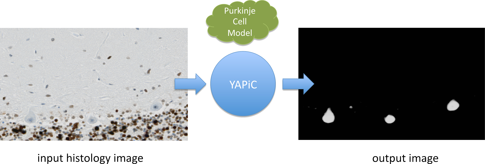

[](https://travis-ci.com/yapic/yapic)


# YAPiC - Yet Another Pixel Classifier (based on deep learning)

## What is YAPiC for?

With YAPiC you can make your own customzied filter (we call it *model* or *classifier*) to enhance a certain structure of your choice.

We can, e.g train a model for detection of oak leafs in color images, and use this oak leaf model to filter out all image regions that are not covered by oak leaves:


* Pixels that belong to other leaf types
  or to no leafs at all are mostly suppressed, they appear dark in the output image.
* Pixels that belong to oak leafs are enhanced, they appear bright in the output image.

The output image is also called a *pobability map*, because the intensity of each pixel corresponds to the probability of the pixel belonging to an oak leave region.

You can train a model for almost any structure you are interested in, for example to detect a certain cell type ist histological micrographs (here: purkinje cells of the human brain):


*Histology data provided by Oliver Kaut (University Clinic Bonn, Dept. of Neurology)*

We have used YAPiC for analyzing various microscopy image data. Our experiments are mainly related to neurobiology, cell biology, histopathology  and drug discovery (high content screening).
However, YAPiC is a very generally applicable tool and can be applied to very different domains. It could be used for detecting e.g. forest regions in satellite images, clouds in landscape photographs or fried eggs in food photography.


## Examples

* [Live cell imaging](docs/example_neurite.md): Detection of neurites in
  label-free time lapse imaging.
* [Digital Pathology](docs/example_histo.md): Detection of specific cell types
  in histological micrographs.
* [Electron Microscopy](docs/example_actin_em.md): Detection of actin filaments in
  transmission electron micrographs.


## How does it work?


## How to use it

### Command line interface

### Python API

## How to install

### Linux

* Install [Python 3.6.](https://www.python.org/downloads/)

* Install [Git](https://git-scm.com/book/en/v2/Getting-Started-Installing-Git).

* Install Cython

```
pip install Cython
```

* Install Tensorflow
    * if you want to use GPU processing (recommended)

    ```
    pip install tensorflow-gpu
    ```

    * For CPU processing (just for testing, do not use it in production)

    ```
    pip install tensorflow
    ```

* Install YAPiC

```
pip install yapic
```

* Run unit tests to check if everything works

```
pip install pytest
pytest -s -v -m "not slow"
```

If you get following error ```ImportError: cannot import name 'abs'```
you may downgrade tensorflow-gpu to version 1.8.0:
```
pip install tensorflow-gpu==1.8.0
```

### Windows and Mac

YAPiC is currently only supported on Linux. It runs in principle on Mac OS,
but installing Tensorflow with GPU support in currently [not that straightforward
on Mac OS](https://docs.anaconda.com/anaconda/user-guide/tasks/tensorflow/).
We may release Docker images in the future to run YAPiC easily in Windows and
Mac workstations.


## Hardware Recommendations

YAPiC is designed to run on dedicated hardware. In production, it
should not run on your everyday-work notebook, but on a dedicated workstation or a
server. The reason is, that training a model requires long time (multiple hours
to multiple days) and a lot of computing power. Running these processes in the
background on your notebook while e.g. writing E-Mails is not feasible. Moreover, you will need powerful GPU hardware that is normally not available on office notebooks.   


* Using fast SSD hard drives (PCIe SSDs) for storing training data may increase
  training speed, compared to conventional hard drives. Have a look at the [GPU requirements for Tensorflow](https://www.tensorflow.org/install/gpu)
* From our expericence you can have already quite good performance with NVIDIA Geforce
  boards (mainly intended for gaming). These are cheaper than professional
  NVIDIA Tesla GPUs.
* GPU RAM requirements: RAM of your GPU hardware is often a bottleneck and depends the specific project. RAM requirements depend on the number of classes you want to train
  and if you use a 2D network or 3D network. Some recommendations, based on our
  personal experience:

  * For training a *unet_2D* with two classes (foreground, background), 5 GB
    RAM on your GPU is sufficient.
  * For training a *unet_multi_z* with five z-layers and two classes, 11 GB RAM
    on GPU is sufficient.


## About us
<!-- .element height="50%" width="50%" -->

YAPiC is developed by the [Core Reseach Facilities](https://www.dzne.de/forschung/core-facilities/) of the [DZNE](https://www.dzne.de/en) (German Center for Neurodegenerative Diseases).
