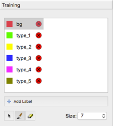

1. Install YAPiC as explained [here](index.html)

1. The command line tool ```yapic``` should be available now:
   ```
   yapic --help
   ```

1. Download and unzip [leaf example data](example_data/leaves_example_data.zip).
   It contains following files:
   ```
   leaves_example_data/
   ├── leaf_labels.ilp
   ├── leaves_1.tif
   ├── leaves_2.tif
   ├── leaves_3.tif
   ├── leaves_4.tif
   ├── leaves_5.tif
   ├── leaves_6.tif
   └── leaves_7.tif
   ```
   The *tif* files are RGB images containing photographs of different leaf types.
   The images were saved with (Fiji)[https://fiji.sc]. Make sure to always
   convert your pixel images with Fiji. Large image series can be conveniently
   converted with Fiji by using
   [batch processing](https://imagej.net/Batch_Processing).

   The *ilp* file is a so called *ilastik Project File* and contains training  labels.
   Next, we will have a look at the labels.

1. For looking at the label data, download and install [Ilastik](https://ilastik.org)

1. Launch Ilastik and open the ilastik project *leaf_labels.ilp*

   

   You see manually drawn labels for the *leaves_7.tif* image. There are labels
   for 6 different classes: 5 leaf types and the backgound class (red).
   In *current view* you can select one of the other images.

   Ilastik comes with built in functionality for classifier training and pixel classification. It is very convenient to use and much faster than the deep-learing based classificaton of YAPiC. However this leaf
   classification task, can not be solved with Ilastik's built in classification.
   For this reason, we use Ilastik in this case just as a tool for labeling
   and will train a classifier with YAPiC.

1. Add some more training data.

   

   Choose some other images with less labels and use the brush to paint
   more image regions. The more labels you have, the better will be your
   training result. Amount of labels should be more or less balanced between
   all classes.

1. Save your updated Ilastik project: ```Project>>Save Project...```

1. Now you can start a training session with *YAPiC* command line tool:
   ```
   yapic train unet_2d "path/to/leaves_example_data/*.tif" path/to/leaves_example_data/leaf_labels.ilp -e 2500 --gpu=0
   ```   

   * *unet_2d* defines the type of deep learning model to train. We choose the
    original U-Net architecture as described in [this paper](https://arxiv.org/pdf/1505.04597.pdf).
   * Next, we define the pixel data source with a wildcard
     With wildcards you have to use quotation marks.
   * Next, we have to define the label data source. In our case the ilastik project file ```path/to/leaves_example_data/leaf_labels.ilp```    
   * The optional argument *e* defines the number of training epochs, i.e. the
     length of the training process.
   * If you have multiple GPU cards available, you can select a specific GPU
     with the optional *--gpu* argument.
   * Use ```yapic --help``` to get an overview about all arguments.  

1. Training progress can be observed via command line output. Training 2500
   epochs will take several hours.
   ```
   Epoch 5/2500
   50/50 [==============================] - 63s 1s/step - loss: 1.7317 - accuracy:    5.3919 - val_loss: 1.6949 - val_accuracy: 3.7496
   Epoch 6/2500
   50/50 [==============================] - 64s 1s/step - loss: 1.7241 - accuracy:    5.0915 - val_loss: 1.6836 - val_accuracy: 3.8097
   Epoch 7/2500
   50/50 [==============================] - 64s 1s/step - loss: 1.7246 - accuracy:    5.4757 - val_loss: 1.6919 - val_accuracy: 3.6405
   Epoch 8/2500
   17/50 [=========>....................] - ETA: 27s - loss: 1.7165 - accuracy:    5.5103
   ```
   Training progress is also logged to *loss.csv*.
